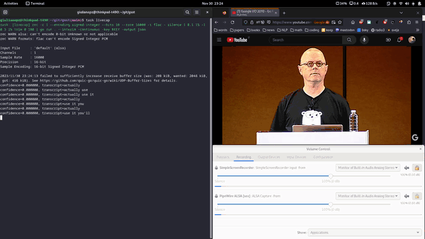

# gstt

A Go client to call the Google Speech API for free.

The Google Speech API (full duplex version) are meant to offer a speech recognition service via the [Web Speech API](https://developer.mozilla.org/en-US/docs/Web/API/Web_Speech_API/Using_the_Web_Speech_API) on the [Google Chrome](https://source.chromium.org/chromium/chromium/src/+/main:content/browser/speech/speech_recognition_engine.cc) browser. They are different from the [Google Cloud Speech-to-Text API](https://cloud.google.com/speech-to-text/v2/docs). 

The API can be called using the API key built into Chrome. To find your key, go to the [demo](https://www.google.com/intl/en/chrome/demos/speech.html) page for the Web Speech API on Chrome and capture the network traffic with the Chrome [net export](chrome://net-export/) tool. Then, inspect the logs with the [netlog viewer](https://netlog-viewer.appspot.com/#import) tool.

> Disclaimer: The Google Speech API is an internal API and [totally unsupported](https://lists.w3.org/Archives/Public/public-speech-api/2013Jul/0001.html). Also, please consider asking for a official [key](https://www.chromium.org/developers/how-tos/api-keys/) reserved to developers, although it comes with some limitations.

### Usage

Import it as a package:
```go

import (
    "github.com/giulianopz/go-gstt/pkg/client"
    "github.com/giulianopz/go-gstt/pkg/transcription"
)

func main() {

    var (
        httpC   = client.New()
        out     = make(chan *transcription.Response)
    )

    go func() {
	    for resp := range out {
            for _, result := range resp.Result {
                for _, alt := range result.Alternative {
                    fmt.Printf("confidence=%f, transcript=%s\n", alt.Confidence, strings.TrimSpace(alt.Transcript))
                }
            }
        }
    }()


    httpC.Transcribe(audio, out, options)
}
```

Use it as a command:
```bash
$ git clone https://github.com/giulianopz/go-gstt
$ cd go-gstt
$ go build -o gstt .
$ mv gstt /usr/local/bin
# or just `go install github.com/giulianopz/go-gstt@latest`, if you don't want to rename the binary
$ gstt -h
Usage:
    gstt [OPTION]... --key $KEY --output [pb|json]
    gstt [OPTION]... --key $KEY --interim --continuous --output [pb|json]

Options:
        --verbose
        --file, path of audio file to trascript
        --key, api key built into chromium
        --output, transcriptions output format ('pb' for binary or 'json' for text)
        --language, language of the recording transcription, use the standard webcodes for your language, i.e. 'en-US' for English-US, 'ru' for Russian, etc. please, see https://en.wikipedia.org/wiki/IETF_language_tag
        --continuous, to keep the stream open and transcoding as long as there is no silence
        --interim, to send back results before its finished, so you get a live stream of possible transcriptions as it processes the audio
        --max-alts, how many possible transcriptions do you want
        --pfilter, profanity filter ('0'=off, '1'=medium, '2'=strict)
        --user-agent, user-agent for spoofing
# trascribe audio from a single FLAC file
$ gstt --interim --continuous --key $KEY --output json --file $FILE
# trascribe audio from microphone input (recorded with sox, removing silence)
$ rec -c 1 --encoding signed-integer --bits 16 --rate 16000 -t flac - silence 1 0.1 1% -1 0.5 1% | gstt --interim --continuous --key $KEY --output json
```

### Demo

Live-caption speech redirecting speakers output to microphone input with PulseAudio Volume Control ([pavucontrol](https://www.kirsle.net/redirect-audio-out-to-mic-in-linux)): 



([how-to-gif](https://gist.github.com/paulirish/b6cf161009af0708315c))

### Credits

As far as I know, this API has been going around since a long time, although its URL was changed a few times.  

[Mike Pultz](https://mikepultz.com/2011/03/accessing-google-speech-api-chrome-11/) was possibly the first one to discover it in 2011. Subsequently, [Travis Payton](http://blog.travispayton.com/wp-content/uploads/2014/03/Google-Speech-API.pdf) published a detailed report on the subject.


